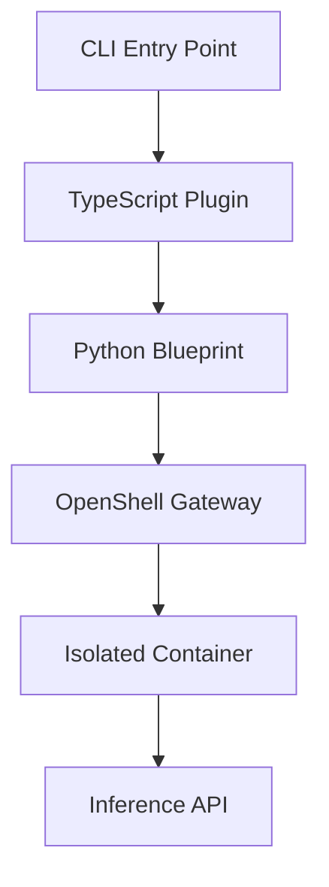

# NVIDIA NemoClaw: OpenClaw Plugin for OpenShell

<!-- start-badges -->
[](https://github.com/NVIDIA/NemoClaw/blob/main/LICENSE)
[](https://github.com/NVIDIA/NemoClaw/blob/main/SECURITY.md)
[](https://github.com/NVIDIA/NemoClaw/blob/main/docs/about/release-notes.md)
<!-- end-badges -->

NVIDIA NemoClaw is an open source stack that simplifies running [OpenClaw](https://openclaw.ai) always-on assistants safely. It installs the [NVIDIA OpenShell](https://github.com/NVIDIA/OpenShell) runtime, part of [NVIDIA Agent Toolkit](https://docs.nvidia.com/nemo/agent-toolkit/latest), a secure environment for running autonomous agents, with inference routed through [NVIDIA cloud](https://build.nvidia.com).

> **Alpha software**
>
> NemoClaw is early-stage. Expect rough edges. We are building toward production-ready sandbox orchestration, but the starting point is getting your own environment up and running.
> Interfaces, APIs, and behavior may change without notice as we iterate on the design.
> The project is shared to gather feedback and enable early experimentation, but it
> should not yet be considered production-ready.
> We welcome issues and discussion from the community while the project evolves.

---

## Quick Start

<!-- start-quickstart-guide -->

Follow these steps to get started with NemoClaw and your first sandboxed OpenClaw agent.

:::{note}
NemoClaw currently requires a fresh installation of OpenClaw.
:::

### Prerequisites

Check the prerequisites before you start to ensure you have the necessary software and hardware to run NemoClaw.

#### Software

- Linux Ubuntu 22.04 LTS releases and later
- Node.js 20+ and npm 10+ (the installer recommends Node.js 22)
- Docker installed and running
- [NVIDIA OpenShell](https://github.com/NVIDIA/OpenShell) installed

### Install NemoClaw and Onboard OpenClaw Agent

Download and run the installer script.
The script installs Node.js if it is not already present, then runs the guided onboard wizard to create a sandbox, configure inference, and apply security policies.

```console
$ curl -fsSL https://nvidia.com/nemoclaw.sh | bash
```

When the install completes, a summary confirms the running environment:

```
──────────────────────────────────────────────────
Sandbox      my-assistant (Landlock + seccomp + netns)
Model        nvidia/nemotron-3-super-120b-a12b (NVIDIA Cloud API)
──────────────────────────────────────────────────
Run:         nemoclaw my-assistant connect
Status:      nemoclaw my-assistant status
Logs:        nemoclaw my-assistant logs --follow
──────────────────────────────────────────────────

[INFO]  === Installation complete ===
```

### Chat with the Agent

Connect to the sandbox, then chat with the agent through the TUI or the CLI.

```console
$ nemoclaw my-assistant connect
```

#### OpenClaw TUI

The OpenClaw TUI opens an interactive chat interface. Type a message and press Enter to send it to the agent:

```console
sandbox@my-assistant:~$ openclaw tui
```

Send a test message to the agent and verify you receive a response.

#### OpenClaw CLI

Use the OpenClaw CLI to send a single message and print the response:

```console
sandbox@my-assistant:~$ openclaw agent --agent main --local -m "hello" --session-id test
```

<!-- end-quickstart-guide -->

---

## How It Works

NemoClaw installs the NVIDIA OpenShell runtime and Nemotron models, then uses a versioned blueprint to create a sandboxed environment where every network request, file access, and inference call is governed by declarative policy. The `nemoclaw` CLI orchestrates the full stack: OpenShell gateway, sandbox, inference provider, and network policy.

| Component        | Role                                                                                      |
|------------------|-------------------------------------------------------------------------------------------|
| **Plugin**       | TypeScript CLI commands for launch, connect, status, and logs.                            |
| **Blueprint**    | Versioned Python artifact that orchestrates sandbox creation, policy, and inference setup. |
| **Sandbox**      | Isolated OpenShell container running OpenClaw with policy-enforced egress and filesystem.  |
| **Inference**    | NVIDIA cloud model calls, routed through the OpenShell gateway, transparent to the agent.  |

The blueprint lifecycle follows four stages: resolve the artifact, verify its digest, plan the resources, and apply through the OpenShell CLI.

When something goes wrong, errors may originate from either NemoClaw or the OpenShell layer underneath. Run `nemoclaw <name> status` for NemoClaw-level health and `openshell sandbox list` to check the underlying sandbox state.

---

## Architecture

NemoClaw follows a three-layer architecture with clear separation between presentation, orchestration, and infrastructure:



**Comprehensive architecture diagrams** are available in `docs/architecture/`:

- **[System Overview](docs/architecture/system-overview.mermaid)** - High-level component architecture
- **[Onboarding Flow](docs/architecture/onboarding-flow.mermaid)** - Complete onboarding sequence diagram
- **[Inference Routing](docs/architecture/inference-routing.mermaid)** - Request routing and provider selection
- **[Component Interactions](docs/architecture/component-interactions.mermaid)** - Code organization and dependencies
- **[Deployment Model](docs/architecture/deployment-model.mermaid)** - Runtime deployment and storage

**Key architectural patterns:**
- **Layered architecture** - CLI → Plugin → Blueprint → Infrastructure
- **Blueprint pattern** - Declarative infrastructure as code
- **Gateway pattern** - Centralized inference routing
- **Plugin architecture** - Minimal coupling with OpenClaw

See **[docs/architecture/README.md](docs/architecture/README.md)** for detailed architecture documentation, design principles, and extension guides.

---

## Inference

Inference requests from the agent never leave the sandbox directly. OpenShell intercepts every call and routes it to the NVIDIA cloud provider.

| Provider     | Model                               | Use Case                                       |
|--------------|--------------------------------------|-------------------------------------------------|
| NVIDIA cloud | `nvidia/nemotron-3-super-120b-a12b` | Production. Requires an NVIDIA API key.         |

Get an API key from [build.nvidia.com](https://build.nvidia.com). The `nemoclaw onboard` command prompts for this key during setup.

---

## Protection Layers

The sandbox starts with a strict baseline policy that controls network egress and filesystem access:

| Layer      | What it protects                                    | When it applies             |
|------------|-----------------------------------------------------|-----------------------------|
| Network    | Blocks unauthorized outbound connections.           | Hot-reloadable at runtime.  |
| Filesystem | Prevents reads/writes outside `/sandbox` and `/tmp`.| Locked at sandbox creation. |
| Process    | Blocks privilege escalation and dangerous syscalls. | Locked at sandbox creation. |
| Inference  | Reroutes model API calls to controlled backends.    | Hot-reloadable at runtime.  |

When the agent tries to reach an unlisted host, OpenShell blocks the request and surfaces it in the TUI for operator approval.

---

## Key Commands

### Host commands (`nemoclaw`)

Run these on the host to set up, connect to, and manage sandboxes.

| Command                              | Description                                            |
|--------------------------------------|--------------------------------------------------------|
| `nemoclaw onboard`                  | Interactive setup wizard: gateway, providers, sandbox. |
| `nemoclaw deploy <instance>`         | Deploy to a remote GPU instance through Brev.          |
| `nemoclaw <name> connect`            | Open an interactive shell inside the sandbox.          |
| `openshell term`                     | Launch the OpenShell TUI for monitoring and approvals. |
| `nemoclaw start` / `stop` / `status` | Manage auxiliary services (Telegram bridge, tunnel).   |

### Plugin commands (`openclaw nemoclaw`)

Run these inside the OpenClaw CLI. These commands are under active development and may not all be functional yet.

| Command                                    | Description                                              |
|--------------------------------------------|----------------------------------------------------------|
| `openclaw nemoclaw launch [--profile ...]` | Bootstrap OpenClaw inside an OpenShell sandbox.          |
| `openclaw nemoclaw status`                 | Show sandbox health, blueprint state, and inference.     |
| `openclaw nemoclaw logs [-f]`              | Stream blueprint execution and sandbox logs.             |

See the full [CLI reference](https://docs.nvidia.com/nemoclaw/latest/reference/commands.md) for all commands, flags, and options.

> **Known limitations:**
> - The `openclaw nemoclaw` plugin commands are under active development. Use the `nemoclaw` host CLI as the primary interface.
> - Setup may require manual workarounds on some platforms. File an issue if you encounter blockers.

---

## Learn More

Refer to the documentation for more information on NemoClaw.

### For Developers and Autonomous Agents

- **[AGENTS.md](AGENTS.md)**: **Start here!** Comprehensive development guide for contributors and autonomous agents. Covers setup, build commands, test commands, code conventions, and common tasks.

### Documentation

- [Overview](https://docs.nvidia.com/nemoclaw/latest/about/overview.html): what NemoClaw does and how it fits together
- [How It Works](https://docs.nvidia.com/nemoclaw/latest/about/how-it-works.html): plugin, blueprint, and sandbox lifecycle
- [Architecture](https://docs.nvidia.com/nemoclaw/latest/reference/architecture.html): plugin structure, blueprint lifecycle, and sandbox environment
- [Inference Profiles](https://docs.nvidia.com/nemoclaw/latest/reference/inference-profiles.html): NVIDIA cloud inference configuration
- [Network Policies](https://docs.nvidia.com/nemoclaw/latest/reference/network-policies.html): egress control and policy customization
- [CLI Commands](https://docs.nvidia.com/nemoclaw/latest/reference/commands.html): full command reference

## Security

### Environment Variables and Secrets

NemoClaw uses environment variables for sensitive configuration like API keys. **Never commit `.env` files to version control.**

1. **Copy the template:**
   ```bash
   cp .env.example .env
   ```

2. **Fill in your values:**
   - `NVIDIA_API_KEY`: Get from [build.nvidia.com](https://build.nvidia.com)
   - Optional bot tokens for Telegram, Slack, or Discord integrations

3. **Verify `.env` is ignored:**
   ```bash
   git check-ignore .env  # Should output: .env
   ```

The `.gitignore` file is configured to exclude:
- `.env` and all `.env.*` files (except `.env.example`)
- IDE configs (.vscode/, .idea/)
- SSH keys and credentials
- Certificates and keystores

Pre-commit hooks include secret scanning via `detect-secrets` to catch accidental commits of sensitive data.

### Automated Dependency Updates

Dependabot automatically monitors dependencies and creates pull requests for updates:
- **Schedule**: Weekly on Mondays at 9:00 AM
- **Coverage**: npm (TypeScript), Python, GitHub Actions, Docker
- **Grouping**: Minor and patch updates grouped together to reduce noise
- **Labels**: Auto-tagged with `dependencies` for easy filtering

Configuration: `.github/dependabot.yml`

See [SECURITY.md](SECURITY.md) for reporting security vulnerabilities.

## Feature Flags

NemoClaw supports feature flags for safe rollout of experimental features:

```bash
# Enable all experimental features (local inference, new endpoints)
export NEMOCLAW_EXPERIMENTAL=1

# Check which flags are active
nemoclaw feature-flags
```

See [docs/feature-flags.md](docs/feature-flags.md) for complete documentation of all available flags.

---

## Releases and Changelog

NemoClaw uses automated release notes generation. All changes are documented in [CHANGELOG.md](CHANGELOG.md).

**Creating a release**:
```bash
git tag -a v0.2.0 -m "Release v0.2.0"
git push origin v0.2.0
# GitHub Actions automatically generates release notes
```

**Commit message conventions** (for contributors):
- `feat:` → Features section
- `fix:` → Bug Fixes section  
- `docs:` → Documentation section

See [docs/releases.md](docs/releases.md) for complete release documentation.

**Published artifacts**:
- **Docker images**: `ghcr.io/nvidia/nemoclaw` (GitHub Container Registry)
- **npm package**: `nemoclaw` (npm registry)

See [docs/deployment.md](docs/deployment.md) for deployment automation details.

**Observability**:
- **Structured logging**: JSON logs with pino for better debugging and monitoring
- **Distributed tracing**: Trace ID propagation through CLI → Blueprint → Sandbox → Inference
- **Metrics collection**: Performance telemetry (command duration, inference latency, error rates)
- **Error tracking**: Sentry integration with source maps, breadcrumbs, and trace context (opt-in)
- **Alerting**: Alert rules for PagerDuty/OpsGenie/Slack (error rate, latency, service health)
- **Product analytics**: PostHog integration for feature usage tracking and impact measurement (opt-in)
- **Error to insight pipeline**: Automatic GitHub issue creation from production errors via Sentry integration
- See [docs/observability.md](docs/observability.md) for full documentation

**Error to Insight Pipeline:**

Automatically convert production errors into actionable GitHub issues:

```bash
# Configure Sentry-GitHub integration
SENTRY_ORG=your-org
SENTRY_PROJECT=nemoclaw
```

**Workflow:**
1. Error occurs in production → Sentry captures with full context
2. Sentry creates GitHub issue automatically (for new/high-impact errors)
3. Issue includes: stack trace, breadcrumbs, user impact, Sentry link
4. Developer fixes bug, commits with "Fixes #123"
5. Issue auto-closes, Sentry marks error as resolved
6. If error recurs → Issue reopened (regression alert)

**Benefits:**
- No manual error copying
- Rich context in GitHub issues
- Automatic deduplication
- Workflow integration

For complete setup guide, see [docs/error-to-insight-pipeline.md](docs/error-to-insight-pipeline.md).

---

## Monitoring

NemoClaw provides comprehensive observability for production deployments.

**Dashboard Setup:**

Create dashboards in your monitoring platform using the metrics collected by NemoClaw:

- **Datadog**: Create dashboard at `https://app.datadoghq.com/dashboard/lists`
  - Key metrics: `nemoclaw.command.duration`, `nemoclaw.errors`, `nemoclaw.inference.latency`
  - Add deployment markers with DD Events API
  
- **Grafana**: Query Prometheus metrics
  - Example: `rate(nemoclaw_errors_total[5m])`, `histogram_quantile(0.95, rate(nemoclaw_command_duration_bucket[5m]))`
  - Create annotations for deployments
  
- **New Relic**: Custom NRQL queries
  - `SELECT percentile(duration, 95) FROM Transaction WHERE appName = 'nemoclaw'`
  
- **CloudWatch**: Parse structured logs with Insights
  - `fields @timestamp, level, msg | filter level = "error" | stats count() by bin(5m)`

**Deploy Notifications:**

Configure Slack/Discord/Teams webhooks to receive deployment notifications:

```bash
# Example Slack notification
curl -X POST "$SLACK_WEBHOOK_URL" \
  -d '{"text": ":rocket: NemoClaw v1.2.3 deployed to production"}'
```

**Quick Health Check:**

```bash
# View metrics
nemoclaw <command> 2>&1 | jq 'select(.metric_type)'

# Check recent errors  
nemoclaw <command> 2>&1 | jq 'select(.level >= 50)'

# Monitor command duration
nemoclaw <command> 2>&1 | jq -s '[.[] | select(.metric_name == "nemoclaw.command.duration") | .metric_value] | add / length'
```

**Production Dashboard Links:**

Once you set up monitoring dashboards, add links here for your team:

```markdown
- **Metrics**: [Datadog Dashboard](https://app.datadoghq.com/dashboard/[your-dashboard-id])
- **Errors**: [Sentry Project](https://sentry.io/organizations/[org]/projects/nemoclaw/)
- **Logs**: [CloudWatch/Grafana Loki/Datadog Logs](https://your-logging-platform.com)
- **Alerts**: [PagerDuty Service](https://your-org.pagerduty.com/services/[id])
```

**Alerting:**

Set up alerts for critical issues:

```yaml
Critical Alerts (Page On-Call):
  - Error rate > 10/minute for 5 minutes
  - Service down (no metrics for 5 minutes)
  - Inference API unavailable (success rate < 50%)

Warning Alerts (Notify Channel):
  - Elevated errors (> 5/minute for 10 minutes)
  - High latency (p95 > 5s for 10 minutes)
  - High memory usage (> 80% for 15 minutes)
```

For complete alert configurations and integrations, see [docs/observability.md](docs/observability.md#alerting).

---

## Incident Response

**Runbooks and troubleshooting guides:**

NemoClaw provides comprehensive incident response runbooks for production operations.

**Runbook Documentation:** [docs/runbooks.md](docs/runbooks.md)

**Quick Links:**
- [General Troubleshooting](docs/runbooks.md#general-troubleshooting)
- [Sandbox Incidents](docs/runbooks.md#sandbox-incidents)
- [Inference Incidents](docs/runbooks.md#inference-incidents)
- [Deployment Incidents](docs/runbooks.md#deployment-incidents)
- [Performance Incidents](docs/runbooks.md#performance-incidents)
- [Security Incidents](docs/runbooks.md#security-incidents)
- [Escalation Procedures](docs/runbooks.md#escalation-procedures)

**Common Issues:**

**Sandbox won't start:**
```bash
nemoclaw <sandbox> status       # Check status
docker ps -a | grep <sandbox>   # Check container
nemoclaw <sandbox> destroy && nemoclaw onboard  # Recreate if needed
```

**Inference errors:**
```bash
echo $NVIDIA_API_KEY | head -c 10  # Verify API key
curl https://api.nvidia.com/v1/health -H "Authorization: Bearer $NVIDIA_API_KEY"
```

**Deployment failed:**
```bash
npm install && npm run build && npm test  # Local validation
gh run view <run-id>  # Check CI/CD logs
```

**Need help?**
- Runbooks: [docs/runbooks.md](docs/runbooks.md)
- Support: Create an issue or contact your team's on-call engineer

---

## Contributing

See [CONTRIBUTING.md](CONTRIBUTING.md) for development setup, including pre-commit hooks that enforce code quality checks.

**Dev Container:** The fastest way to start contributing is using VS Code Dev Containers (`.devcontainer/devcontainer.json`). All dependencies and tools are pre-configured. Just open in VS Code and click "Reopen in Container".

**Quick start for contributors:**

```bash
# One command to set up development environment
make dev  # Installs dependencies, builds plugin, sets up pre-commit hooks
```

Alternatively, install pre-commit hooks manually:

```bash
# Install pre-commit hooks (one-time setup)
pip install pre-commit
pre-commit install

# Run checks manually
pre-commit run --all-files
```

**Pull Request Process:**
1. **Fill out the PR template** (`.github/pull_request_template.md`) - GitHub loads it automatically
2. **Run all checks** before submitting:
   - Tests: `npm test`
   - Linters: `cd nemoclaw && npm run check` (TypeScript) and `cd nemoclaw-blueprint && make check` (Python)
   - Pre-commit: `pre-commit run --all-files`
3. **Review for secrets** - CRITICAL: Check diff for API keys, tokens, credentials before submitting
4. **Sign commits** - All commits must be signed: `git commit -s`
5. **Auto-assigned reviewers** - GitHub assigns reviewers based on changed files (`.github/CODEOWNERS`)

**Reporting Issues:**
Use the appropriate issue template when reporting bugs, requesting features, or suggesting improvements:
- **Bug Report**: Reproducible issues with detailed environment info
- **Feature Request**: Enhancement suggestions with use case details
- **Documentation**: Documentation errors or improvements
- **Security**: Public security improvements (use [SECURITY.md](SECURITY.md) for serious vulnerabilities)

Templates ensure maintainers and AI agents have the context needed to address your contributions effectively.

## License

This project is licensed under the [Apache License 2.0](LICENSE).
