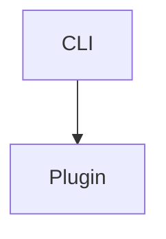

# NemoClaw Architecture Documentation

This directory contains architecture diagrams and documentation for the NemoClaw project.

## Architecture Diagrams

### 1. System Overview (`system-overview.mermaid`)

**High-level architecture** showing the main components and their relationships:
- User Interface (CLI)
- TypeScript Plugin Layer (OpenClaw integration)
- Python Orchestration Layer (Blueprint runner)
- OpenShell Infrastructure (Gateway, Sandbox, Network policies)
- External Services (NVIDIA API, local inference endpoints)

**Use this diagram to understand**:
- How NemoClaw components fit together
- The layered architecture approach
- Integration points with OpenShell
- Inference routing options

### 2. Onboarding Flow (`onboarding-flow.mermaid`)

**Sequence diagram** showing the complete onboarding workflow:
1. User initiates onboarding with profile selection
2. Preflight checks validate system requirements
3. Blueprint orchestration deploys sandbox
4. Inference routing is configured and tested
5. User receives ready-to-use sandbox

**Use this diagram to understand**:
- Step-by-step onboarding process
- Interaction between CLI, Blueprint, and Gateway
- Validation and error handling checkpoints
- What happens when `nemoclaw onboard` is executed

### 3. Inference Routing (`inference-routing.mermaid`)

**Data flow diagram** showing how inference requests are routed:
- Request flows from OpenClaw plugin through router
- Authentication and caching layers
- Multiple inference provider options (NVIDIA Cloud, NIM, vLLM, Ollama)
- Observability integration (logs, traces, metrics, error tracking)

**Use this diagram to understand**:
- How inference requests are processed
- Provider selection logic
- Caching strategy
- Observability instrumentation points

### 4. Component Interactions (`component-interactions.mermaid`)

**Detailed component diagram** showing code organization:
- CLI entry points (`bin/`)
- TypeScript plugin structure (`nemoclaw/src/`)
- Python blueprint organization (`nemoclaw-blueprint/`)
- Test suite structure (`test/`)
- Dependencies between components

**Use this diagram to understand**:
- Where specific functionality lives
- How modules depend on each other
- Code organization patterns
- Test coverage structure

### 5. Deployment Model (`deployment-model.mermaid`)

**Deployment architecture** showing runtime organization:
- Developer machine setup (IDE + npm installation)
- Globally installed CLI and embedded plugin/blueprint
- Docker runtime with Gateway and multiple sandboxes
- Inference infrastructure options
- Persistent storage locations

**Use this diagram to understand**:
- How NemoClaw is installed and deployed
- Container orchestration model
- Where configuration and state are stored
- Multi-sandbox management

## Viewing the Diagrams

### In GitHub

Mermaid diagrams render automatically in GitHub markdown. Simply view the `.mermaid` files or include them in markdown:

\`\`\`markdown

\`\`\`

### In VS Code

Install the **Mermaid Preview** extension:
1. Open VS Code
2. Search for "Mermaid Preview" in extensions
3. Open any `.mermaid` file
4. Press `Ctrl+Shift+V` (or `Cmd+Shift+V` on Mac) to preview

### In Documentation

Include diagrams in markdown docs:

\`\`\`markdown
# Architecture


\`\`\`

### Export to PNG/SVG

Using **Mermaid CLI**:

```bash
# Install mermaid-cli
npm install -g @mermaid-js/mermaid-cli

# Generate PNG
mmdc -i system-overview.mermaid -o system-overview.png

# Generate SVG
mmdc -i system-overview.mermaid -o system-overview.svg
```

Using **mermaid.live** (browser):
1. Visit https://mermaid.live/
2. Paste diagram code
3. Click "PNG" or "SVG" to download

## Architecture Principles

### Layered Architecture

NemoClaw follows a **three-layer architecture**:

1. **Presentation Layer** (CLI/Plugin)
   - User interface and command handling
   - Input validation and error messaging
   - TypeScript with strict typing

2. **Business Logic Layer** (Blueprint)
   - Orchestration and policy management
   - State management and migrations
   - Python with Ruff linting

3. **Infrastructure Layer** (OpenShell)
   - Container orchestration
   - Network policy enforcement
   - Inference routing

### Key Design Patterns

1. **Command Pattern**
   - CLI commands as independent handlers
   - Consistent interface for all commands
   - Easy to extend with new commands

2. **Blueprint Pattern**
   - Declarative infrastructure as code
   - Versioned and reproducible deployments
   - State migration support

3. **Gateway Pattern**
   - Single entry point for inference routing
   - Provider abstraction
   - Centralized observability

4. **Plugin Architecture**
   - OpenClaw extension via plugin system
   - Minimal coupling with IDE
   - Reusable across different OpenClaw installations

### Technology Stack

- **CLI**: Node.js 20+ (JavaScript runtime)
- **Plugin**: TypeScript 5.4+ (type-safe development)
- **Blueprint**: Python 3.11+ (orchestration logic)
- **Runtime**: Docker (containerization)
- **Infrastructure**: OpenShell (sandbox management)

## External Dependencies

### Required Services

1. **OpenShell** - Sandbox orchestration platform
   - Manages container lifecycle
   - Enforces network policies
   - Routes inference requests

2. **Docker** - Container runtime
   - Required for OpenShell
   - Manages sandbox isolation
   - Provides network primitives

### Optional Services

1. **NVIDIA Cloud API** (build.nvidia.com)
   - Cloud-hosted inference
   - No GPU required
   - Broadest model selection

2. **Local NIM** (NVIDIA Inference Microservice)
   - Local GPU inference
   - Lower latency
   - Data privacy

3. **vLLM** (Versatile LLM Server)
   - Open-source inference server
   - GPU acceleration
   - Compatible with HuggingFace models

4. **Ollama** (Local Model Runtime)
   - CPU/GPU support
   - Easy model management
   - Good for development

## Data Flow

### Onboarding Workflow

```
User Input → CLI Validation → Preflight Checks → Blueprint Execution → Gateway Deployment → Sandbox Ready
```

### Inference Request

```
IDE Request → Plugin → Gateway → Provider Selection → Inference API → Response → Cache → IDE
```

### State Management

```
Blueprint Plan → OpenShell Apply → State Snapshot → Persistent Storage
```

## Security Considerations

1. **Credential Storage**
   - API keys stored in `~/.config/nemoclaw/credentials.json`
   - File permissions: mode 600 (owner read/write only)
   - Never committed to git (`.gitignore` protection)

2. **Network Isolation**
   - Sandboxes have restricted egress
   - Network policies enforce allowed destinations
   - No direct internet access by default

3. **Container Security**
   - Sandboxes run as non-root user
   - Limited syscall access
   - Resource quotas enforced

## Performance Characteristics

### Inference Latency

- **NVIDIA Cloud**: 500-2000ms (network dependent)
- **Local NIM**: 100-500ms (GPU dependent)
- **vLLM**: 50-300ms (GPU dependent)
- **Ollama**: 200-1000ms (CPU/GPU dependent)

### Caching

- Response caching enabled by default
- Cache hit: <10ms response time
- Cache stored in Gateway memory

### Resource Usage

- **CLI**: ~50MB memory
- **Gateway**: ~200MB memory
- **Sandbox**: ~500MB-2GB memory (model dependent)
- **Disk**: ~2GB per sandbox (includes model cache)

## Extending NemoClaw

### Adding a New Command

1. Create command handler in `nemoclaw/src/commands/`
2. Register in `nemoclaw/src/cli.ts`
3. Add tests in `test/`
4. Update documentation in `docs/reference/commands.md`

### Adding a New Inference Provider

1. Implement provider interface in `bin/lib/`
2. Add provider detection in `bin/lib/onboard.js`
3. Create policy template in `nemoclaw-blueprint/policies/`
4. Add tests and documentation

### Adding a New Blueprint

1. Create blueprint YAML in `nemoclaw-blueprint/`
2. Implement orchestration logic in `orchestrator/`
3. Add migration scripts if needed
4. Test with `nemoclaw onboard`

## Troubleshooting

### Common Issues

1. **Sandbox fails to start**
   - Check Docker is running: `docker ps`
   - Check OpenShell is installed: `which openshell`
   - Review Gateway logs: `nemoclaw logs`

2. **Inference timeout**
   - Check network connectivity
   - Verify API credentials
   - Check provider health status

3. **Blueprint execution fails**
   - Verify blueprint syntax: `yamllint blueprint.yaml`
   - Check Python dependencies: `uv sync`
   - Review orchestrator logs

## Contributing

When modifying the architecture:

1. **Update diagrams** - Keep diagrams in sync with code
2. **Document decisions** - Explain why, not just what
3. **Add examples** - Show how new components integrate
4. **Update this README** - Keep it current

## References

- [Mermaid Documentation](https://mermaid.js.org/)
- [OpenShell Documentation](https://github.com/openclaw/openshell)
- [NVIDIA API Documentation](https://build.nvidia.com/explore/discover)
- [NemoClaw AGENTS.md](../../AGENTS.md)
- [NemoClaw README](../../README.md)

---

**Last Updated**: 2026-03-22  
**Maintained by**: NVIDIA NemoClaw Team  
**For Questions**: See [AGENTS.md](../../AGENTS.md) or open an issue
